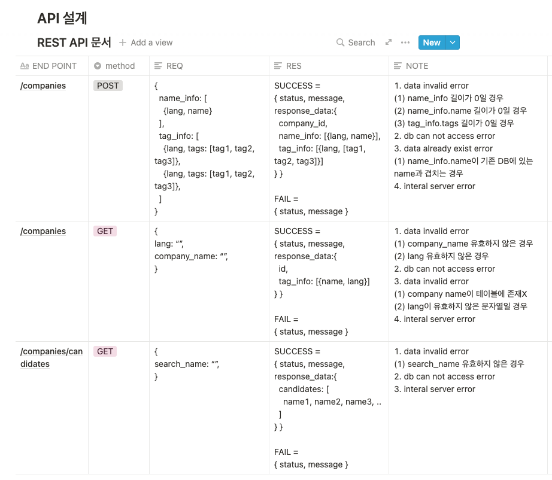
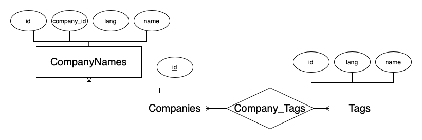

# wantedlab21-assignment

## What is this project for

원티드랩 21년도 해, 커리어 서버 개발자 채용과정의 코딩 과제입니다.
도커를 사용해 개발했습니다.

## How this project works

```bash
# 이미지 빌드 및 컨테이너 실행
docker-compose -f docker-compose.dev.yml up -d --build

# docker 관련 파일 변경 없이(이미지 상태 그대로) 컨테이너 실행
docker-compose -f docker-compose.dev.yml up -d

# 컨테이너 중지 및 삭제(이때 volume은 삭제되지 않음에 유의)
docker-compose -f docker-compose.dev.yml down

```

-   flask는 debug mode == ON 으로 설정함
-   따라서, 이미지 변경 없이 서버만 코드 변경했을 때는 컨테이너 런 다시 안해도 됨.

## API 문서(임시)



-   기능 1. 새로운 회사 추가하기 - /companies/ POST
-   기능 2. 회사 이름으로 회사 검색하기 - /companies/ GET
-   기능 3. 자동완성 - /companies/candidates/ GET

## DB 문서



## Github Commit Convention

-   feat: 새로운 기능 추가
-   fix: 버그 픽스
-   docs: 문서 수정
-   style: 포맷, 세미콜론 수정, Optimize import, Code clean up 등 코드가 아닌 스타일에 관련된 수정
-   refactor: 코드 리펙토링
-   test: 테스트 코드 추가
-   chore: 빌드 관련 업무 수정(안드로이드의 경우 builde.gradle, manifest)
